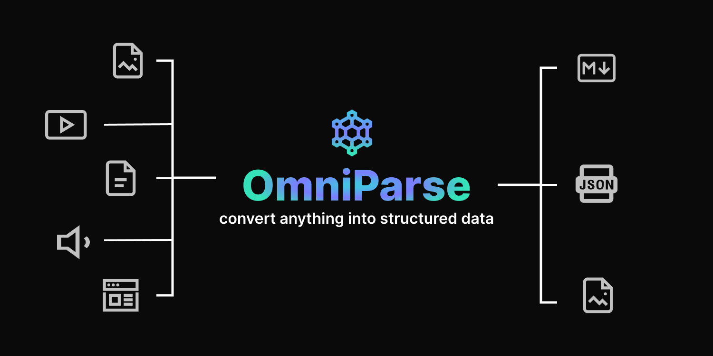

# 可将任何非结构化数据提取并解析为针对 GenAI （LLM） 应用程序优化的结构化、可作数据。
# 无论是在处理文档、表格、图像、视频、音频文件还是网页
# RAG前置步骤

# 步骤：
- docker部署：
```sh
docker pull savatar101/omniparse:0.1

# 前置步骤：安装好cuda和对应的cudnn等内容采取GPU加速；否则只能cpu解析，相对会慢一些，不过其实也差不了多少；
# if you are running on a gpu 
docker run --gpus all -p 8000:8000 savatar101/omniparse:0.1
# else
docker run -p 8000:8000 savatar101/omniparse:0.1
```

- 之后就可以在localhost:8000打开网页可视化界面了

# API封装说明：
- 网页界面有详细的curl内容，比如解析文档`curl -X POST -F "file=@/path/to/document" http://localhost:8000/parse_document`等内容,由于已经实现api，所以可以直接封装进网页来获取返回的JSON结构从而获取返回的数据；
- 支持文件包括：
  - Documents: .doc, .docx, .pdf, .ppt, .pptx, .doc、.docx、.pdf、.ppt .pptx
  - Images: .png, .jpg, .jpeg, .tiff, .bmp, .heic .png、.jpg、.jpeg、.tiff、.bmp .heic
  - Video: .mp4, .mkv, .avi, .mov  .mp4、.mkv、.avi .mov
  - Audio: .mp3, .wav, .aac  .mp3、.wav、.aac
  - Web网页
- 全部转化为相关说明文字的md文件，方便后续RAGFlow解析


